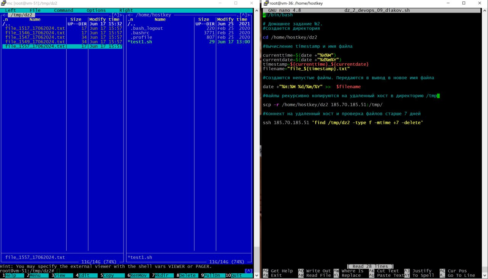
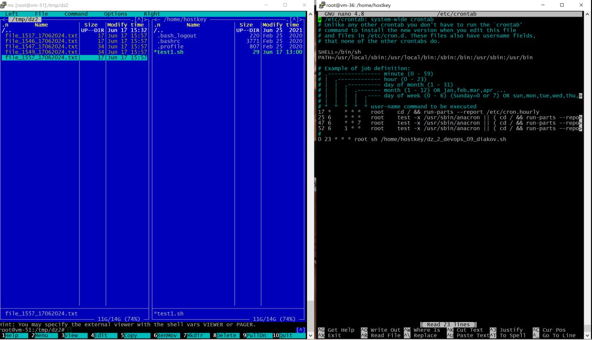

## Лекция 2
### Задание
Написать скрипт, который создает не пустые файлы на одной
машине и передает их на другую машину. Скрипт запускается по
CRON на первой машине. Также скрипт управляет временем
хранения файлов на второй машине, которое не должно
превышать одной недели.
### Вариант решения:
~~~bash
GNU nano 4.8                dz_2_devops_09_diakov.sh
#!/bin/bash

#Домашнее задание №2.
#Создается директория

cd /home/hostkey/dz2

#Вычисление timestamp и имя файла

currenttime=$(date +"%H%M")
currentdate=$(date +"%d%m%Y")
timestamp=${currenttime}_${currentdate}
filename="file_${timestamp}.txt"

#Создаются непустые файлы. Передаю в вывод в новое имя файла
 
date +"%H:%M %d/%m/%Y" >>  $filename

#Копирую файлы на удаленный хост

scp -r /home/hostkey/dz2 185.70.185.51:/tmp/

#Коннект на удаленный хост и проверка файлов старше 7 дней

ssh 185.70.185.51 'find /tmp/dz2 -type f -mtime +7 -delete'
~~~

