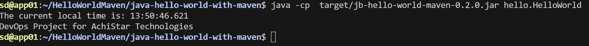

## Лекция 3
### Задание
В репозитории GitHub найти проекты на Java, собрать их с
помощью системы сборки Maven. Получить артефакты сборки
JAR, WAR файлы. WAR артефакты запустить в контейнере
сервлетов Apache Tomcat.

### Вариант решения:

Проект  
https://github.com/jabedhasan21/java-hello-world-with-maven.git  
для получения артифактов сборки JAR/WAR.  
WAR'ник получен путем сборки в ide IntelliJIDEA.
 
Результат консольного вывода 
